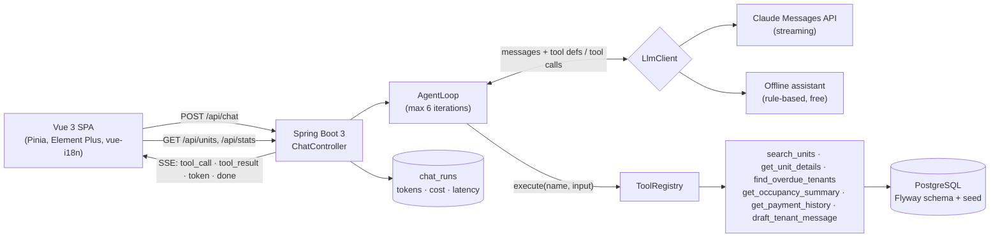

# PropPilot

**A bilingual (English / Arabic) AI assistant for property managers: ask a question in either language and an agent answers by calling typed tools against a property database, streaming its work live.**

> **Live demo:** https://proppilot-lake.vercel.app (the free-tier API sleeps when idle, so the first request can take about a minute)
>
> _30-second demo GIF goes here (save it as `docs/demo.gif` and embed it). Suggested recording: the chat answering "Who is more than 30 days late on rent?" then switching to Arabic._

All data is fake seed data (3 cities, 6 buildings, 150 units, 120 tenants, 12 months of payments). No real companies or people.

## What it shows

- **A hand-written agent loop** (no Spring AI / LangChain4j): send messages and tool definitions, run the tools the model asks for, feed results back, repeat, with a hard iteration cap.
- **Tool registry:** every tool is a Spring bean implementing `Tool`; the registry collects them and generates the tool list for the API. Tools are read-only and typed (no raw SQL from the model) and return clean errors the model can act on.
- **Streaming UX over SSE:** the UI shows live "Searching units…" chips, then streams the answer.
- **Cost and latency tracking** per question (`chat_runs` table, shown under each answer and on a Usage page).
- **Real Arabic support:** vue-i18n, `dir="rtl"` flipping, Element Plus Arabic locale, bidi-safe numbers.
- **Zero-cost by default:** the app runs with a built-in offline assistant, so it works with no API key. Set one env var to switch to real Claude.

## Architecture



## How the agent loop works

`AgentLoop` ([source](backend/src/main/java/dev/proppilot/agent/AgentLoop.java)) is the whole idea in about 20 lines:

```java
for (int iteration = 1; iteration <= props.maxIterations(); iteration++) {
    LlmResponse response = llm.complete(new LlmRequest(system, List.copyOf(messages), toolSpecs),
            text -> events.accept(new AgentEvent.Token(text)));          // stream answer text as it arrives
    usage = usage.plus(response.usage());
    messages.add(new Message(Message.Role.ASSISTANT, response.content()));

    var requested = response.toolUses();
    if (requested.isEmpty()) {                                           // final answer
        return new AgentResult(response.text(), usage, toolCalls, iteration, Status.OK);
    }
    messages.add(new Message(Message.Role.USER, runTools(requested, events)));  // results go back to the model
    toolCalls += requested.size();
}
return gaveUp();                                                         // iteration cap reached
```

- `ToolRegistry.execute` never throws: bad input, unknown tools and unexpected failures come back as error results (`is_error: true`), so the model can correct itself instead of the request failing.
- The system prompt tells the model to reply in the user's language, only state numbers returned by tools, and name which tools its data came from.
- `LlmClient` has two implementations: `AnthropicLlmClient` (plain HTTP + a hand-written SSE stream parser for text and tool-use blocks) and `OfflineLlmClient`.
- The agent loop is tested against a scripted fake LLM: tool round trips, error feedback, the iteration cap, LLM failures, history handling.

### SSE events

`POST /api/chat` with `{"message": "...", "history": [{"role":"user|assistant","text":"..."}]}`:

| Event | Payload |
|---|---|
| `tool_call` | `{name, args}` |
| `tool_result` | `{name, summary, error}` |
| `token` | `{text}` |
| `error` | `{message}` |
| `done` | `{runId, status, provider, model, inputTokens, outputTokens, toolCalls, iterations, latencyMs, costUsd}` |

```bash
curl -N -X POST localhost:8080/api/chat -H 'Content-Type: application/json' \
  -d '{"message":"Who is more than 30 days late on rent?"}'
```

## Evals

`evals/questions.json` has 20 questions (10 English, 10 Arabic) with expected facts and expected tools. `node evals/run.mjs` runs them against a live backend and prints pass rate, average cost and average latency.

Latest run (offline assistant, Docker Compose stack, seeded data):

| Set | Passed | Pass rate | Avg cost / question | Avg latency |
|---|---|---|---|---|
| All | 20/20 | 100% | $0.00000 | 30 ms |
| English | 10/10 | 100% | $0.00000 | 48 ms |
| Arabic | 10/10 | 100% | $0.00000 | 12 ms |

> **Read this honestly:** the offline assistant is a keyword router written against these question shapes, so 100% here proves the data, tools, streaming and answer pipeline are correct, **not** language-model quality. The same eval is the real benchmark for Claude: run it with `LLM_PROVIDER=anthropic` and replace this table with the result (the script reports real cost and latency).

```bash
CHAT_RATE_LIMIT_PER_MINUTE=1000 ./mvnw -f backend/pom.xml spring-boot:run   # or: docker compose up
node evals/run.mjs --url http://localhost:8080
```

## Tech stack

| Layer | Choice |
|---|---|
| Backend | Java 21, Spring Boot 3.5, Spring Web, Spring Data JPA, PostgreSQL 16, Flyway, Maven |
| LLM | Anthropic Messages API over plain HTTP with streaming; offline assistant for zero cost |
| Frontend | Vue 3 (`<script setup>`), TypeScript, Vite, Pinia, Element Plus, vue-i18n, vue-router |
| Quality | JUnit 5, Mockito, Testcontainers (PostgreSQL), Vitest, GitHub Actions |
| Infra | Docker Compose; Render (API) + Neon (Postgres) + Vercel (frontend), all free tiers |

## Run locally

```bash
cp .env.example .env        # optional: only needed to use real Claude
docker compose up --build   # Postgres + backend + frontend
```

- App: http://localhost:3000 · API: http://localhost:8080 · Health: http://localhost:8080/actuator/health

For development with hot reload:

```bash
docker compose up -d db
cd backend && ./mvnw spring-boot:run          # http://localhost:8080
cd frontend && npm ci && npm run dev          # http://localhost:5173 (proxies /api to :8080)
```

### Using real Claude

```bash
LLM_PROVIDER=anthropic ANTHROPIC_API_KEY=sk-ant-... docker compose up --build
```

### Environment variables

| Variable | Default | Purpose |
|---|---|---|
| `LLM_PROVIDER` | `offline` | `offline` (free, no key) or `anthropic` |
| `ANTHROPIC_API_KEY` | – | Required for `anthropic`. Read only by the backend, never sent to the browser |
| `ANTHROPIC_MODEL` | `claude-haiku-4-5-20251001` | Model id |
| `LLM_PRICE_INPUT_PER_MTOK` / `LLM_PRICE_OUTPUT_PER_MTOK` | `1.00` / `5.00` | USD per million tokens, used for the cost estimate |
| `DB_URL` / `DB_USER` / `DB_PASSWORD` | local Postgres | JDBC connection |
| `CORS_ALLOWED_ORIGINS` | `http://localhost:5173` | Comma-separated frontend origins |
| `CHAT_MAX_MESSAGE_LENGTH` | `500` | Max characters per question |
| `CHAT_RATE_LIMIT_PER_MINUTE` | `10` | Per-client limit on `/api/chat` |
| `CHAT_DAILY_LIMIT` | `500` | Global daily cap on questions (protects your API budget) |
| `VITE_API_URL` (frontend build) | empty | Backend base URL when the frontend is hosted separately |

## Tests

```bash
cd backend && ./mvnw verify      # 64 tests; integration tests start PostgreSQL via Testcontainers (needs Docker)
cd frontend && npm test          # 15 Vitest tests: SSE parser + chat store
```

Backend: the agent loop against a mocked LLM, the registry, the Anthropic stream parser, every tool against the real seeded database, the SSE endpoint end to end, rate limiter, cost calculator, units API. CI (`.github/workflows/ci.yml`) builds and tests both on every push.

## Safety

- Chat endpoint: per-client rate limit, global daily cap, max message length, bounded history.
- The API key lives only in the backend environment; CORS is restricted to configured frontend origins.
- Tools are read-only and take typed inputs. `draft_tenant_message` returns a draft and never sends anything.
- Tool failures never leak internals to the model or the user.

## Deployment

Zero-cost path, step by step: [docs/DEPLOYMENT.md](docs/DEPLOYMENT.md).

## Design decisions

- **Stateless chat:** the client sends recent turns with each question, so the server stores no conversations and no tenant text beyond the question in `chat_runs`.
- **Offline provider:** keeps the demo and the evals free, and proves the loop is independent of any one model.
- **Seed is deterministic and date-relative:** payments always cover the 12 months before the migration date; 11 "chronic" tenants are always the most overdue, which keeps eval facts stable.
- **Tool results are capped** (15 rows) with the total count included, so the model never needs to see a whole table.

## What I'd do next

- RAG over lease PDFs (clauses, notice periods) as another tool.
- Write actions (send reminder, log maintenance request) behind human approval with an audit trail.
- Auth and multi-tenant portfolios.
- Prompt caching and a model-routing step (cheap model for lookups, stronger for drafting).
- A Flutter client against the same SSE API.
