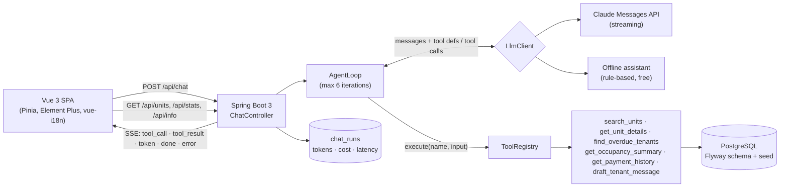

# PropPilot

[](https://github.com/NguyenMinhDuc98/proppilot/actions/workflows/ci.yml)

**A bilingual (English / Arabic) AI assistant for property managers: ask a question in either language and an agent answers by calling typed tools against a property database, streaming its work live.**

> **Live demo:** https://proppilot-lake.vercel.app runs **real Claude (Haiku 4.5)**. A badge at the top of the app always shows the active mode: `Claude Haiku 4.5` or `Offline demo`. Run locally with no key and it uses the free offline assistant instead. The free-tier API sleeps when idle, so the first request after a pause can take a few minutes while it wakes up.

All data is fake seed data (3 cities, 6 buildings, 150 units, 120 tenants, 12 months of payments). No real companies or people.

## What it shows

- **A hand-written agent loop** (no Spring AI / LangChain4j): send messages and tool definitions, run the tools the model asks for, feed results back, repeat, with a hard iteration cap.
- **Tool registry:** every tool is a Spring bean implementing `Tool`; the registry collects them and generates the tool list for the API. Tools are read-only and typed (no raw SQL from the model) and return clean errors the model can act on.
- **Streaming UX over SSE:** the UI shows live "Searching units…" chips, then streams the answer.
- **Cost and latency tracking** per question (`chat_runs` table, shown under each answer and on a Usage page).
- **A transparent agent:** every answer has an expandable "How I answered" panel showing the tool call and its arguments, what the tool returned, tokens, cost and latency.
- **Real Arabic support:** vue-i18n, `dir="rtl"` flipping, Element Plus Arabic locale, bidi-safe numbers.
- **Resilient LLM calls:** retries with exponential backoff and jitter on 429/5xx/529 (never after text has streamed), a per-question run deadline, replies cut off by `max_tokens` detected and flagged, and coded errors with localized messages (raw provider text never reaches the browser).
- **Honest accounting:** a run that the browser abandons is still recorded with the tokens and cost spent so far (`ABORTED`).
- **Privacy by default:** the public Usage page shows aggregates only; visitors' question text is readable only through an admin endpoint behind a token.
- **Zero-cost by default:** the app runs with a built-in offline assistant, so it works with no API key. Set one env var to switch to real Claude.

## Architecture



## How the agent loop works

`AgentLoop` ([source](backend/src/main/java/dev/proppilot/agent/AgentLoop.java)) is the whole idea. Each step is one model call and the tools it asked for (simplified from `step()`):

```java
var interruption = interruption();               // the client left, or the run is out of time
if (interruption.isPresent()) return interruption;

var response = llm.complete(new LlmRequest(system, List.copyOf(messages), toolSpecs, timeLeft()),
        text -> events.accept(new AgentEvent.Token(text)));       // stream text as it arrives
usage = usage.plus(response.usage());

if (response.stopReason() == StopReason.MAX_TOKENS) {             // tool calls may be cut off: run none
    return Optional.of(result(Status.TRUNCATED, response.text()));
}
messages.add(new Message(Message.Role.ASSISTANT, response.content()));

var requested = response.toolUses();
if (requested.isEmpty()) {                                        // final answer
    return Optional.of(result(Status.OK, response.text()));
}
return runTools(requested);                                       // results go back on the next step
```

The loop repeats steps until a final answer, the iteration cap (default 6) or the run deadline (default 90 s).

- `ToolRegistry.execute` never throws: bad input, unknown tools and unexpected failures come back as error results (`is_error: true`), so the model can correct itself instead of the request failing.
- The system prompt tells the model to reply in the user's language, only state numbers returned by tools, and not to mention internal tool names; the UI shows the data sources itself as localized labels.
- `LlmClient` has two implementations: `AnthropicLlmClient` (plain HTTP, a retry policy, a stream watchdog, and a hand-written SSE parser for text and tool-use blocks) and `OfflineLlmClient`.
- The agent loop is tested against a scripted fake LLM: tool round trips, error feedback, the iteration cap, truncation, cancellation, the deadline, LLM failures and history handling.

### SSE events

`POST /api/chat` with `{"message": "...", "history": [{"role":"user|assistant","text":"..."}]}`:

| Event | Payload |
|---|---|
| `tool_call` | `{name, args}` |
| `tool_result` | `{name, summary, error}` |
| `token` | `{text}` |
| `error` | `{message, code}`, where `code` is `llm_overloaded`, `llm_timeout`, `llm_auth`, `llm_error` or `run_timeout` |
| `done` | `{runId, status, provider, model, inputTokens, outputTokens, toolCalls, iterations, latencyMs, costUsd, truncated}` |

```bash
curl -N -X POST localhost:8080/api/chat -H 'Content-Type: application/json' \
  -d '{"message":"Who is more than 30 days late on rent?"}'
```

## Evals

`evals/questions.json` has 20 questions (10 English, 10 Arabic) with expected facts and expected tools. `node evals/run.mjs` runs them against a live backend and prints pass rate, average cost and average latency.

Latest run against **real Claude** (`claude-haiku-4-5-20251001`, seeded data, backend on a laptop talking to the Anthropic API):

| Set | Passed | Pass rate | Avg cost / question | Avg latency |
|---|---|---|---|---|
| All | 20/20 | 100% | $0.0059 | 4.2 s |
| English | 10/10 | 100% | $0.0055 | 3.6 s |
| Arabic | 10/10 | 100% | $0.0063 | 4.8 s |

Tool selection was correct on all 20 questions: the right tool was called every time, and the answers were in the language of the question.

The first Claude run scored 16/20. I read the four failing answers: all were correct, and my grader was too literal (it wanted `4800` but Claude wrote `4,800`, and in Arabic Claude wrote `لم يُدفع` instead of the raw status `UNPAID`). I fixed the grader to ignore number formatting and accept alternative wordings of the same fact, and did not change what is being checked.

The free **offline assistant** (a keyword router written against these question shapes) also scores 20/20 at $0 and about 30 ms. That only shows the data, tools and streaming pipeline are correct; the Claude run above is the meaningful benchmark.

```bash
CHAT_RATE_LIMIT_PER_MINUTE=1000 ./mvnw -f backend/pom.xml spring-boot:run   # or: docker compose up
node evals/run.mjs --url http://localhost:8080
```

## Tech stack

| Layer | Choice |
|---|---|
| Backend | Java 21, Spring Boot 3.5, Spring Web, Spring Data JPA, PostgreSQL 16, Flyway, Maven |
| LLM | Anthropic Messages API over plain HTTP with streaming; offline assistant for zero cost |
| Frontend | Vue 3 (`<script setup>`), TypeScript, Vite, Pinia, Element Plus, vue-i18n, vue-router |
| Quality | JUnit 5, Mockito, Testcontainers (PostgreSQL), Vitest, GitHub Actions |
| Infra | Docker Compose; Render (API) + Neon (Postgres) + Vercel (frontend), all free tiers |

## Run locally

```bash
cp .env.example .env        # optional: only needed to use real Claude
docker compose up --build   # Postgres + backend + frontend
```

- App: http://localhost:3000 · API: http://localhost:8080 · Health: http://localhost:8080/actuator/health

For development with hot reload:

```bash
docker compose up -d db
cd backend && ./mvnw spring-boot:run          # http://localhost:8080
cd frontend && npm ci && npm run dev          # http://localhost:5173 (proxies /api to :8080)
```

### Using real Claude

```bash
LLM_PROVIDER=anthropic ANTHROPIC_API_KEY=sk-ant-... docker compose up --build
```

### Environment variables

| Variable | Default | Purpose |
|---|---|---|
| `LLM_PROVIDER` | `offline` | `offline` (free, no key) or `anthropic` |
| `ANTHROPIC_API_KEY` | – | Required for `anthropic`. Read only by the backend, never sent to the browser |
| `ANTHROPIC_MODEL` | `claude-haiku-4-5-20251001` | Model id |
| `LLM_PRICE_INPUT_PER_MTOK` / `LLM_PRICE_OUTPUT_PER_MTOK` | `1.00` / `5.00` | USD per million tokens, used for the cost estimate |
| `DB_URL` / `DB_USER` / `DB_PASSWORD` | local Postgres | JDBC connection |
| `CORS_ALLOWED_ORIGINS` | `http://localhost:5173` | Comma-separated frontend origins |
| `LLM_MAX_TOKENS` | `2048` | Longest single model reply; a reply that hits it is cut off and flagged |
| `LLM_MAX_RETRIES` | `3` | Extra attempts after a transient failure (429, 5xx, 529, network) |
| `AGENT_RUN_TIMEOUT_SECONDS` | `90` | Longest a single question may run, retries included |
| `CHAT_MAX_MESSAGE_LENGTH` | `500` | Max characters per question |
| `CHAT_MAX_HISTORY_ITEMS` | `20` | Most earlier messages a request may carry (the web app reads this from `/api/info`) |
| `ADMIN_TOKEN` | – | Enables `GET /api/admin/runs` (header `X-Admin-Token`); 24+ characters or the backend refuses to start; unset = endpoints answer 404 |
| `CHAT_RATE_LIMIT_PER_MINUTE` | `10` | Per-client limit on `/api/chat` |
| `CHAT_DAILY_LIMIT` | `500` | Global daily cap on questions (protects your API budget) |
| `VITE_API_URL` (frontend build) | empty | Backend base URL when the frontend is hosted separately |

## Tests

```bash
cd backend && ./mvnw verify      # 222 tests; integration tests start PostgreSQL via Testcontainers (needs Docker)
cd frontend && npm test          # 76 Vitest tests: SSE parser, chat store, Markdown sanitising, trace builder, error codes, info badge
```

Backend: the agent loop against a scripted LLM, retry policy and the Anthropic client against an in-process HTTP server (429/529 then success, 401, mid-stream errors, `max_tokens` truncation), run outcomes (OK, ERROR, TRUNCATED, ABORTED, deadline), admin authentication, every tool against the real seeded database, the SSE endpoint end to end, rate limiter, cost calculator, units API. CI (`.github/workflows/ci.yml`) builds and tests both on every push.

## Safety

- Chat endpoint: per-client rate limit, global daily cap, max message length, bounded history (item count and size), per-question run deadline.
- Visitors' question text is never public: `/api/stats` returns aggregates only, and `/api/admin/runs` needs an `ADMIN_TOKEN` header (compared in constant time, never accepted in a URL).
- The API key lives only in the backend environment; CORS is restricted to configured frontend origins.
- Tools are read-only and take typed inputs. `draft_tenant_message` returns a draft and never sends anything.
- Tool failures never leak internals to the model or the user, and raw LLM provider errors are logged server-side only.

## Deployment

Zero-cost path, step by step: [docs/DEPLOYMENT.md](docs/DEPLOYMENT.md).

## Design decisions

- **Stateless chat:** the client sends recent turns with each question, so the server stores no conversations; the only stored text is each question in `chat_runs`, readable through the admin endpoint.
- **Offline provider:** keeps the demo and the evals free, and proves the loop is independent of any one model.
- **Seed is deterministic and date-relative:** payments always cover the 12 months before the migration date; 11 "chronic" tenants are always the most overdue, which keeps eval facts stable.
- **Tool results are capped** (15 rows) with the total count included, so the model never needs to see a whole table.

## What I'd do next

- RAG over lease PDFs (clauses, notice periods) as another tool.
- Write actions (send reminder, log maintenance request) behind human approval with an audit trail.
- Auth and multi-tenant portfolios.
- Prompt caching and a model-routing step (cheap model for lookups, stronger for drafting).
- A Flutter client against the same SSE API.

## License

MIT, see [LICENSE](LICENSE).
